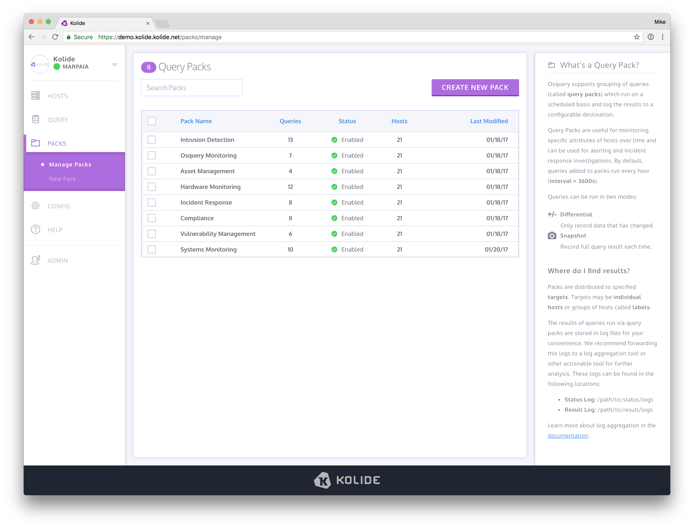
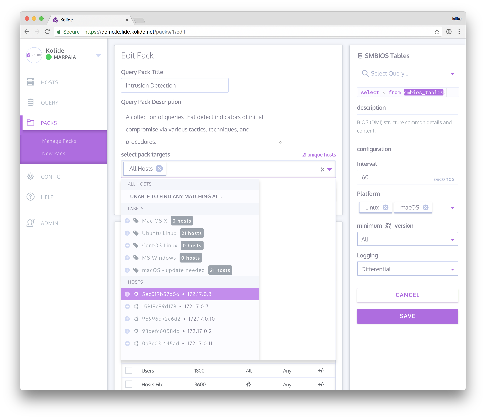
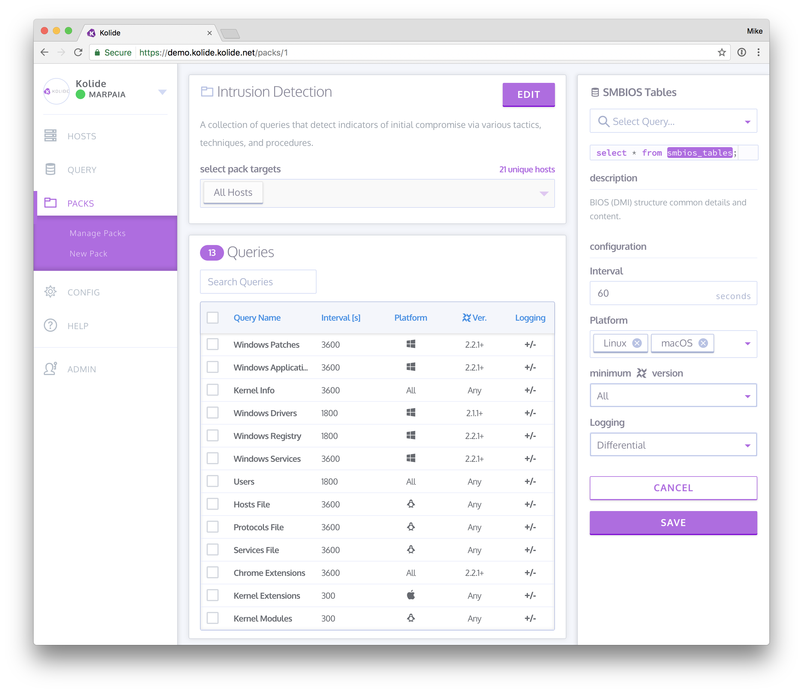

Scheduling Queries
==================

As discussed in the [Running Queries Documentation](./running-queries.md), you can use the Fleet application to create, execute, and save osquery queries. You can organize these queries into "Query Packs". To view all saved packs and perhaps create a new pack, select "Manage Packs" from the "Packs" sidebar. Packs are usually organized by the general class of instrumentation that you're trying to perform.

If you select a pack from the list, you can quickly enable and disable the entire pack, or you can configure it further.

When you edit a pack, you can decide which targets you would like to execute the pack. This is a similar selection experience to the target selection process that you use to execute a new query.

To add queries to a pack, use the right-hand sidebar. You can take an existing scheduled query and add it to the pack. You must also define a few key details such as:

- interval: how often should the query be executed?
- logging: which osquery logging format would you like to use?
- platform: which operating system platforms should execute this query?
- minimum osquery version: if the table was introduced in a newer version of osquery, you may want to ensure that only sufficiently recent version of osquery execute the query.
- shard: from 0 to 100, what percent of hosts should execute this query?

Once you've scheduled queries and curated your packs, you can read our guide to [Working With Osquery Logs](../infrastructure/working-with-osquery-logs.md).

