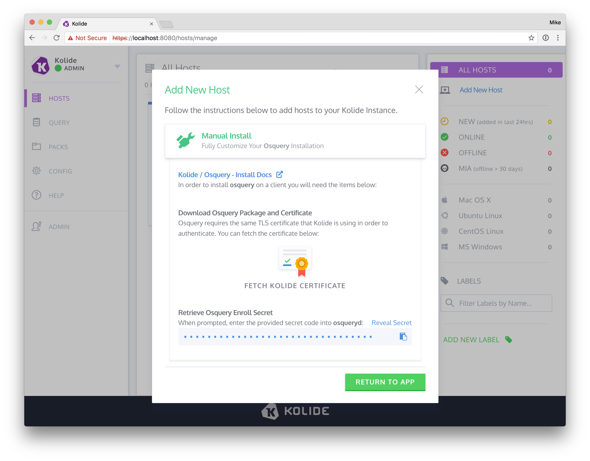

Kolide on Ubuntu
================

In this guide, we're going to install Kolide and all of it's application dependencies on an Ubuntu 16.04 LTS server. Once we have Kolide up and running, we're going to install osquery on that same Ubuntu 16.04 host and enroll it in Kolide. This should give you a good understanding of both how to install Kolide as well as how to install and configure osquery such that it can communicate with Kolide.

## Setting up a host

Acquiring an Ubuntu host to use for this guide is largely an exercise for the reader. If you don't have an Ubuntu host readily available, feel free to use [Vagrant](https://www.vagrantup.com/). In a clean, temporary directory, you can run the following to create a vagrant box, start it, and log into it:

```
$ echo 'Vagrant.configure("2") do |config|
  config.vm.box = "bento/ubuntu-16.04"
  config.vm.network "forwarded_port", guest: 8080, host: 8080
end' > Vagrantfile
$ vagrant up
$ vagrant ssh
```

## Installing Kolide

To install Kolide, go to the [Product and License](https://kolide.co/account/product-and-license) section of the Kolide website.

```
$ wget -qO - https://dl.kolide.co/archive.key | sudo apt-key add -
$ sudo add-apt-repository "deb https://dl.kolide.co/apt jessie main"
$ sudo apt-get update
$ sudo apt-get install kolide
```

## Installing and configuring dependencies

### MySQL

To install the MySQL server files, run the following:

```
$ sudo apt-get install mysql-server -y
```

When asked for MySQL's root password, enter `toor` for the sake of this tutorial if you are having trouble thinking of a better password for the MySQL root user.

After installing `mysql-server`, the `mysqld` server should be running. You can verify this by running the following:

```
$ ps aux | grep mysqld
mysql    13158  3.1 14.4 1105320 146408 ?      Ssl  21:36   0:00 /usr/sbin/mysqld
```

It's also worth creating a MySQL database for us to use at this point. Run the following to create the `kolide` database in MySQL. Note that you will be prompted for the password you created above.

```
$ echo 'CREATE DATABASE kolide;' | mysql -u root -p
```

### Redis

To install the Redis server files, run the following:

```
$ sudo apt-get install redis-server -y
```

To start the Redis server in the background, you can run the following:

```
$ sudo redis-server &
```

Note that this isn't a very robust way to run a Redis server. Digital Ocean has written a very nice [community tutorial](https://www.digitalocean.com/community/tutorials/how-to-install-and-configure-redis-on-ubuntu-16-04) on installing and running Redis in a more productionalized way.

## Running the Kolide server

Now that we have installed Kolide, MySQL, and Redis, we are ready to launch Kolide! First, we must "prepare" the database. We do this via `kolide prepare db`:

```
$ /usr/bin/kolide prepare db \
    --mysql_address=127.0.0.1:3306 \
    --mysql_database=kolide \
    --mysql_username=root \
    --mysql_password=toor
```

The output should look like:

```
OK    20161118193812_CreateTableAppConfigs.go
OK    20161118211713_CreateTableDistributedQueryCampaignTargets.go
...
OK    20170124230432_CreateTableEmailChanges.go
goose: no migrations to run. current version: 20170124230432
OK    20161223115449_InsertOsqueryOptions.go
OK    20161229171615_InsertBuiltinLabels.go
goose: no migrations to run. current version: 20161229171615
```

Before we can run the server, we need to generate some TLS keying material. If you already have tooling for generating valid TLS certificates, then you are encouraged to use that instead. You will need a TLS certificate and key for running the Kolide server. If you'd like to generate self-signed certificates, you can do this via:

```
$ openssl genrsa -out /tmp/server.key 4096
$ openssl req -new -key /tmp/server.key -out /tmp/server.csr
$ openssl x509 -req -days 366 -in /tmp/server.csr -signkey /tmp/server.key -out /tmp/server.cert
```

You should now have three new files in `/tmp`:

- `/tmp/server.cert`
- `/tmp/server.key`
- `/tmp/server.csr`

Now we are ready to run the server! We do this via `kolide serve`:

```
$ /usr/bin/kolide serve \
  --mysql_address=127.0.0.1:3306 \
  --mysql_database=kolide \
  --mysql_username=root \
  --mysql_password=toor \
  --redis_address=127.0.0.1:6379 \
  --server_cert=/tmp/server.cert \
  --server_key=/tmp/server.key \
  --logging_json
```

Now, if you go to [https://localhost:8080](https://localhost:8080) in your local browser, you should be redirected to [https://localhost:8080/setup](https://localhost:8080/setup) where you can create your first Kolide user account.

## Installing and running osquery

> Note that this whole process is outlined in more detail in the [Adding Hosts To Kolide](./adding-hosts-to-kolide.md) document. The steps are repeated here for the sake of a continuous tutorial.

To install osquery on Ubuntu, you can run the following:

```
$ sudo apt-key adv --keyserver keyserver.ubuntu.com --recv-keys 1484120AC4E9F8A1A577AEEE97A80C63C9D8B80B
$ sudo add-apt-repository "deb [arch=amd64] https://osquery-packages.s3.amazonaws.com/xenial xenial main"
$ sudo apt-get update
$ sudo apt-get install osquery
```

You will need to set the osquery enroll secret and osquery server certificate. If you head over to the manage hosts page on your Kolide instance (which should be [https://localhost:8080/hosts/manage](https://localhost:8080/hosts/manage)), you should be able to click "Add New Hosts" and see a modal like the following:



If you select "Fetch Kolide Certificate", your browser will download the appropriate file to your downloads directory (to a file probably called `localhost-8080.pem`). Copy this file to your Ubuntu host at `/var/osquery/server.pem`.

You can also select "Reveal Secret" on that modal and the enrollment secret for your Kolide instance will be revealed. Copy that text and create a file with it's contents:

```
$ echo 'LQWzGg9+/yaxxcBUMY7VruDGsJRYULw8' > /var/osquery/enroll_secret
```

Now you're ready to run the `osqueryd` binary:

```
sudo /usr/bin/osqueryd \
  --enroll_secret_path=/var/osquery/enroll_secret \
  --tls_server_certs=/var/osquery/server.pem \
  --tls_hostname=localhost:8080 \
  --host_identifier=hostname \
  --enroll_tls_endpoint=/api/v1/osquery/enroll \
  --config_plugin=tls \
  --config_tls_endpoint=/api/v1/osquery/config \
  --config_tls_refresh=10 \
  --disable_distributed=false \
  --distributed_plugin=tls \
  --distributed_interval=3 \
  --distributed_tls_max_attempts=3 \
  --distributed_tls_read_endpoint=/api/v1/osquery/distributed/read \
  --distributed_tls_write_endpoint=/api/v1/osquery/distributed/write \
  --logger_plugin=tls \
  --logger_tls_endpoint=/api/v1/osquery/log \
  --logger_tls_period=10
```

If you go back to [https://localhost:8080/hosts/manage](https://localhost:8080/hosts/manage), you should have a host successfully enrolled in Kolide! For information on how to further use the Kolide application, see the [Application Documentation](../application/README.md).
